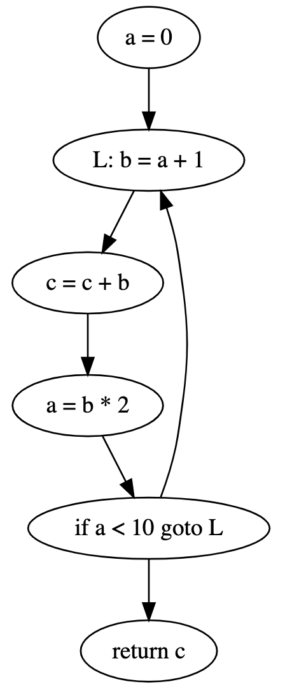

# CS179E Phase 3: Register Allocation
by Brandon Yi

## Requirements and Specifications

This phase of the project implements the translation of the Vapor intermediate language into the VaporM intermediate language. The main difference between Vapor and VaporM is that VaporM uses registers and stacks instead of local variables. 

# Design

### Overview

There are two main phases to the register allocation process. The first phase is liveness calculation and the second phase is the actual register allocation. The first phase operates on a control flow graph which is constructed from the source code supplied to the compiler. The second phase uses the output from the first phase to determine how to assign registers to local variables. The two phases are described below.

### Liveness Calculation

Liveness calculation translates a control flow graph into a set of live ranges per function in the program. The control flow graph is constructed simply by following how a given program will execute. For example, the following program will produce the following control flow graph:

```
1. a = 0
2. L: b = a + 1
3. c = c + b
4. a = b * 2
5. if a < 10 goto L
6. return c
```



This control flow graph is then used to see which local variables are "live" at every point in the program. For example, `a` is live on the edges `1-2, 4-2`, 'b' is live on the edge `2-4` and `c` is alive the entire time. The edges where a variable is live is the variable's live range. These live ranges are used by the linear scan register allocation algorithm. 

Live ranges are produced by the class `LiveRangeVisitor.java`. The `LiveRangeVisitor` class does a depth first visit on the syntax tree for a Vapor program and records where each local variable is used or defined. This information can be directly translated into live ranges for each local variable in the function by doing the following calculation:

```
for each CFGNode n:
	n.in = {}; // empty set
	n.out = {};
	
do {
	for each CFGNode n:
		n.inPrime = n.in
		n.outPrime = n.out
		n.in = n.use union (n.out - n.def)
		n.out = union (s exists in n.successors) s.in
} while (n.inPrime = n.in and n.outPrime = n.out for all n)
```

### Linear Scan Register Allocation

The linear scan register allocation algorithm by Massimiliano Poletto and Vivek Sarkar, "allocates registers to variables in a single linear-time scan of the variables’ live ranges."[^1] The algorithm tries to fit all of the local variables in a function into registers. If there are not enough registers to fit all of the local variables into, the algorithm will spill them onto a stack. The stack which the algorithm spills these local variables onto is a stack provided by the VaporM language. 

## Testing and Verification

Along with the basic tests provided by this couse, I added a couple more special cases. These cases include: 

|    Test File     | Description                                                  |
| :--------------: | ------------------------------------------------------------ |
|    Call.vapor    | A more simple function call test.                            |
| ManyLocals.vapor | A test which uses more local variables than registers available. |

While this project does use `gradle`, you must supply the test files to the program manually and use a Vapor interpreter to verfity the results. Supply the `-mips` flag to the interpreter to be able to run VaporM programs (e.g. `java -jar vapor.jar run -mips p.vaporm`). 


[^1]: Poletto et. al. 1999

